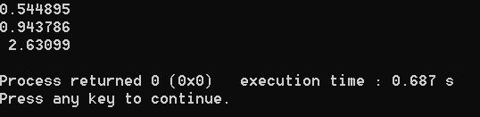
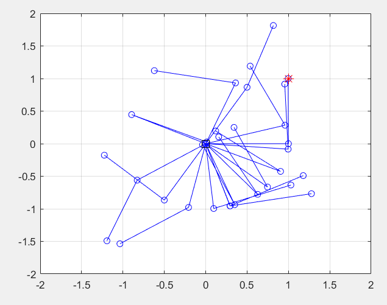
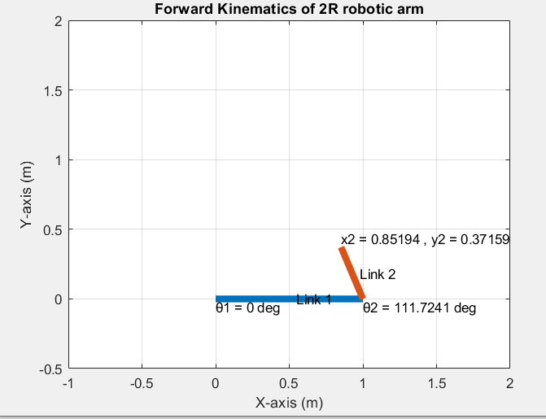
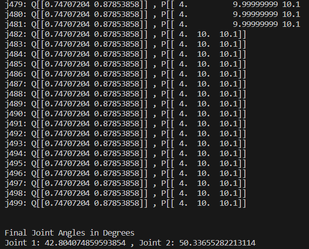

  <h1 align="center">FORWARD AND INVERSE KINEMATICS USING NEWTON RHAPSON METHOD</h1>

Code written and executed using MATLAB, C++ and Python

  

* C++ execution

  

  

* MATLAB executions

  

* Python execution
